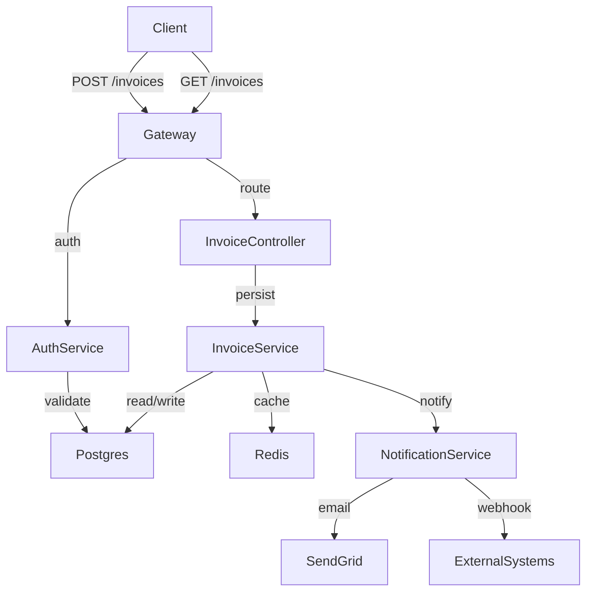

# Agent Files Guide

A practical guide to writing effective `AGENTS.md`, `ARCHITECTURE.md`, and `SKILL.md` files. This guide provides concrete examples, structural guidance, and links to the official specifications.

---

## A. Overview

These files serve as the contract between human developers and AI coding agents. Agents read them to understand project conventions, system design, and available capabilities — without needing to explore the codebase manually.

### File Reference Table

| File | Purpose | Spec URL | Consumers |
|------|---------|----------|-----------|
| `AGENTS.md` | Project context, build commands, code style | [agents.md](https://agents.md/) | All coding agents (OMP, Codex, Cursor, etc.) |
| `ARCHITECTURE.md` | System design, components, data flow | [architecture.md](https://architecture.md/) | Agents working on architecture or cross-component changes |
| `SKILL.md` | Packaged agent capability with instructions | [agentskills.io/spec](https://agentskills.io/specification) | Agents invoked via skill system (OMP skills, etc.) |

### When Files Are Loaded

- **`AGENTS.md`**: Automatically discovered at repo root on every agent session. Never rename or move it.
- **`ARCHITECTURE.md`**: Read on demand when an agent needs to understand system design, or when planning cross-component changes.
- **`SKILL.md`**: Loaded when invoking a skill. Each skill lives in its own directory.

---

## B. AGENTS.md

**Spec**: [agents.md](https://agents.md/) — The open specification for agent project context files.

`AGENTS.md` is the "README for AI agents." It tells agents how to build, test, and style code in this project. Fill every section with concrete values — agents will follow what you write.

### Structural Guidance

**Required sections:**

1. **Project Overview** — Name, description, primary language
2. **Build & Run** — Exact commands for install, build, test, lint, typecheck
3. **Code Style** — Naming conventions, formatting rules, size thresholds
4. **Testing** — How to run tests, coverage expectations, what makes a good test
5. **Error Handling** — The project's error conventions (not aspirational — current)
6. **Agent Behavior** — PR workflow, validation before review, naming conventions

**Optional sections:**
- Project Structure (if non-trivial)
- CI/CD (if it doesn't fit elsewhere)
- Conventions (commits, branches, changelog)

### Concrete Example

Here's a filled-in `AGENTS.md` for a hypothetical TypeScript REST API:

```markdown
# Project Context

> **If this is a new project from the ai-project-template, read [SETUP_GUIDE.md](./SETUP_GUIDE.md) first.**
> **If you're integrating this into an existing project, read [ADOPTING.md](./ADOPTING.md) instead.**

This file is auto-discovered by AI coding agents. It provides project-level context.

## Project Overview

- **Name**: invoice-api
- **Description**: REST API for invoice lifecycle management — create, update, approve, and archive invoices with role-based access control.
- **Primary Language**: TypeScript 5.x

## Build & Run

```bash
npm install
npm run build
npm start
npm test
npm run lint
npx tsc --noEmit
```

## Code Style

- **Max line length**: 100 characters
- **Naming**: `camelCase` for variables and functions, `PascalCase` for classes and types, `SCREAMING_SNAKE_CASE` for constants
- **Import order**: Node built-ins → external packages → internal modules (enforced by ESLint)
- **No default exports** — all exports are named for better refactoring support

### Size Guidelines

| Metric | Limit | Action |
|--------|-------|--------|
| File length | 400 lines | Split into focused modules |
| Function length | 40 lines | Extract helpers |
| Nesting depth | 4 levels | Early return or extract |

## Testing

- Run full suite: `npm test`
- Run subset: `npm test -- --grep "invoice"`
- Coverage threshold: 85% (CI fails below)
- **No mocking external services** — use integration tests with a test database
- **Deterministic tests only** — no reliance on wall-clock time or random state

## Error Handling

- **Never swallow errors** — always log or return them
- **Distinguishable failures** — errors carry context (`{ code, message, context }`)
- **Fail at the boundary** — validate at API entry points, trust internal code
- **Wrap, don't expose** — add context when re-throwing from dependencies

## Agent Behavior

1. **PRs only** — never push directly to `main`
2. **Validate before review** — run `npm run lint && npm test` before requesting review
3. **One concern per change** — separate features, fixes, and refactors
4. **Update docs with code** — if behavior changes, update comments and docs in the same commit

## Conventions

### Commits
```
feat(invoices): add bulk-approve endpoint

Accepts an array of invoice IDs and approves all valid ones.
Returns partial success with failed IDs for retry.
```
Types: `feat`, `fix`, `docs`, `style`, `refactor`, `perf`, `test`, `build`, `ci`, `chore`

### Branches
```
feature/invoice-webhooks
fix/due-date-parsing
chore/upgrade-zod
```

## Template Version

Generated from `ai-project-template` version **0.2.0**.
```

### What to Avoid

- **Don't leave placeholders** — `<!-- ... -->` blocks signal "not done yet" and confuse agents about what's real
- **Don't write aspirational style** — document what the code *does*, not what you'd like it to do
- **Don't omit commands** — agents can't guess `npm run dev` vs `npm start`

### Monorepo Guidance

In a monorepo, place a root `AGENTS.md` for project-wide conventions and nested `AGENTS.md` files for package-specific overrides:

```
monorepo/
  AGENTS.md              # Shared conventions, tooling, structure
  packages/
    invoice-api/
      AGENTS.md          # Override: test command, lint rules
      package.json
    shared-utils/
      AGENTS.md          # Override: no tests, publish config
```

---

## C. ARCHITECTURE.md

**Spec**: [architecture.md](https://architecture.md/) — Architecture-as-code specification.

`ARCHITECTURE.md` is the system design document. It lets an agent understand the codebase structure, component responsibilities, and data flow — without reading every file.

### Structural Guidance

**Core sections:**

1. **Overview** — What does the system do? One paragraph.
2. **System Diagram** — Mermaid diagram showing components and data flow
3. **Project Structure** — Directory layout with purpose annotations
4. **Core Components** — Major components, their responsibilities, invariants
5. **Data Stores** — Databases, caches, file storage
6. **External Integrations** — Third-party services, APIs

**Optional sections:**

- Model Management (if ML involved)
- Deployment (if architecture is deployment-specific)
- Security (auth, secrets, encryption)
- Development Environment (local setup)

### Keep It Living

`ARCHITECTURE.md` goes stale the moment it's written. Keep it updated by:

- **Updating on component changes** — when you add or refactor a component, update its section in the same PR
- **Keeping diagrams current** — Mermaid diagrams are easy to update; stale diagrams are worse than none
- **Naming invariants, not implementation** — describe *what* the component guarantees, not *how* it works

### Concrete Example

```markdown
# Architecture

> This document describes the system design. Keep it updated as the project evolves.

## Overview

The Invoice API manages invoice lifecycle: creation, editing, approval workflow, and archival. It exposes a REST interface with JWT authentication and role-based access control (admin, approver, viewer).

## System Diagram



## Project Structure

```
src/
  api/            # Route definitions and middleware
  controllers/    # Request handling, input validation
  services/       # Business logic, orchestration
  models/         # Database schemas, TypeScript interfaces
  middleware/     # Auth, logging, error handling
  utils/          # Shared helpers
migrations/       # Database migrations
tests/
  unit/           # Service and utility tests
  integration/    # API endpoint tests
  fixtures/       # Test data generators
```

## Core Components

### InvoiceController

- **Responsibility**: HTTP request handling, input validation with Zod, response serialization
- **Invariants**: 
  - All endpoints require valid JWT
  - Input is validated before business logic runs
  - Errors are logged with request ID for tracing

### InvoiceService

- **Responsibility**: Invoice business logic, state machine enforcement, authorization checks
- **Invariants**:
  - Invoice state transitions are atomic (no partial updates)
  - Only `pending` invoices can be approved or rejected
  - Bulk operations return partial success, not full rollback

### AuthService

- **Responsibility**: JWT validation, role extraction, permission checking
- **Invariants**:
  - Tokens are validated on every request
  - Roles are cached in Redis with 5-minute TTL

## Data Stores

| Store | Purpose | Schema |
|-------|---------|--------|
| Postgres | Primary data store for invoices, users, roles | `migrations/` |
| Redis | JWT cache, rate limiting | N/A (key-value) |

## External Integrations

| Service | Purpose | Auth |
|---------|--------|------|
| SendGrid | Email notifications | API key |
| External partner API | Invoice delivery confirmation | OAuth 2.0 |

## Deployment

- **Runtime**: Node.js 22 on containerized platform
- **Scaling**: Horizontal, stateless services behind load balancer
- **Database**: Managed Postgres with read replicas
- **Caching**: Redis cluster with automatic failover
```

---

## D. SKILL.md

**Spec**: [agentskills.io/specification](https://agentskills.io/specification) — Agent skills specification.

A `SKILL.md` is a packaged capability that agents can invoke. Unlike `AGENTS.md` (project context) or `ARCHITECTURE.md` (system design), a skill describes *how to do something specific* — a task pattern, workflow, or specialized knowledge.

### Directory Structure

```
skill-name/
  SKILL.md              # Skill definition (required)
  scripts/              # Helper scripts the skill may invoke
    helper.sh
  references/           # Documentation, templates, configs
    template.md
  assets/               # Images, diagrams (if needed)
```

### SKILL.md Structure

```markdown
---
name: api-review
description: Reviews REST API code for correctness, security, and idiom adherence
category: code-review
tags: [api, security, best-practices]
version: 1.0.0
---

# API Code Review Skill

Reviews REST API implementations against project conventions and security best practices.

## When to Use

Invoke this skill when:
- Creating or modifying API endpoints
- Reviewing a PR that touches the `src/api/` or `src/controllers/` directories
- Adding a new HTTP method or route

## Review Checklist

### Security
- [ ] Authentication check — is the endpoint protected?
- [ ] Input validation — are request bodies parsed with Zod?
- [ ] Rate limiting — is there appropriate throttling?
- [ ] Secrets — no hardcoded credentials or API keys

### Correctness
- [ ] HTTP status codes match semantics (201 for create, 204 for delete, etc.)
- [ ] Error responses include machine-readable codes
- [ ] Async operations return 202 Accepted, not 200

### Idiom
- [ ] Follows the project's error handling patterns
- [ ] Uses existing middleware for common concerns
- [ ] Logs at appropriate level (info for success, warn for recoverable errors)

## Example

Given a new endpoint:

```typescript
// src/controllers/invoices.ts
export async function createInvoice(req: Request, res: Response) {
  const invoice = req.body;
  await InvoiceService.create(invoice);  // ❌ Missing validation, no response
  res.sendStatus(200);                  // ❌ Wrong status for create
}
```

The skill flags:
- Missing input validation (should use `zodSchema.parse()`)
- Wrong status code (should be 201 Created)
- No error handling
- Missing logging

## Output

After review, output a summary:

```markdown
## Review Summary

| Category | Issues Found |
|----------|--------------|
| Security | 2 (auth missing, input not validated) |
| Correctness | 1 (wrong status code) |
| Idiom | 1 (inconsistent error handling) |

**Recommendation**: Do not merge until security issues are resolved.
```
```

### Progressive Disclosure

Write skill files with progressive disclosure:

1. **Frontmatter** — name, description, category, version. Agents scan these first.
2. **When to Use** — one paragraph on when to invoke this skill
3. **Instructions** — step-by-step procedure (numbered, explicit)
4. **Checklist or Output Format** — concrete criteria for evaluation
5. **Example** — shows both bad and good patterns
6. **References** — links to project files, external docs

### Validation

OMP skills can be validated with:

```bash
skills-ref validate ./skills/
```

---

## E. Tiger Style Reference

**Original**: [Tiger Style (TigerBeetle)](https://github.com/tigerbeetle/tigerbeetle/blob/main/docs/TIGER_STYLE.md)

Tiger Style is an engineering philosophy from the TigerBeetle project. While written for Zig, its principles are universally applicable to any high-reliability system.

> **Note**: Tiger Style is aspirational. Adapt the principles to your language and context — don't copy the Zig-specific mechanics verbatim.

### Core Principles

#### Safety

- **Simple control flow** — avoid nesting, prefer early returns. Deeply nested code hides bugs.
- **Bounded everything** — limits on loops, queues, memory, recursion. Unbounded operations eventually fail.
- **Assertions as force multiplier** — `assert()` is not defensive coding; it's a statement that this condition must be true. Use them to catch programmer errors, not runtime failures.
- **Pair assertions with invariants** — if you assert a condition, document *why* it must hold. "assert(count >= 0)" says nothing; "assert(invoice.due_date >= now)" says everything.
- **All errors handled** — every error path is either recovered or propagated. There is no "can't happen" that silently discards an error.

#### Performance

- **Design-phase thinking** — performance problems are architectural. Fix them in the design, not the implementation.
- **Back-of-envelope first** — estimate before you optimize. A 10x improvement that doesn't matter is wasted effort.
- **Batch operations** — amortize overhead by grouping work. One transaction for 100 items beats 100 transactions for 1 item.
- **Amortize costs** — expensive operations (allocations, I/O) should be batched or pooled, not done per-request.

#### Developer Experience

- **Naming matters** — a well-named function is documentation. `findUserById(id)` is clearer than `get(id)`. A well-named variable removes the need for a comment.
- **Say why, not what** — comments should explain *why* the code does something, not *what* it does. The code already says what.
- **Comments are prose** — write complete sentences. Code review is easier when comments read like documentation.
- **Limit function length** — if you can't name a function in two words, it's doing too much.

#### Zero Tech Debt Policy

- **Solve problems when found** — leave the codebase cleaner than you found it. "We'll fix it later" means never.
- **No dead code** — unused functions, commented-out code, vestigial imports all accumulate and confuse future readers.
- **No forwarding addresses** — deleted code leaves no trace. No `// moved to X`, no re-exports "for now."

### Applying Tiger Style

Tiger Style principles apply regardless of language:

| Principle | In TypeScript | In Python | In Go |
|-----------|---------------|-----------|-------|
| Bounded loops | `for (let i = 0; i < limit; i++)` | `for i, item := range items[:limit]` | `for i := 0; i < limit; i++` |
| Assertions | `assert(condition, "must be true")` | `assert condition, "must be true"` | No built-in; use explicit checks |
| Error propagation | Propagate or handle, never ignore | `raise` or `except`, never `pass` | Return error or handle; no panic |

### Further Reading

- [Tiger Style (TigerBeetle)](https://github.com/tigerbeetle/tigerbeetle/blob/main/docs/TIGER_STYLE.md) — Full original document
- [A Philosophy of Software Design](https://web.stanford.edu/~ouster/cgi-bin/book.php) — On naming, functions, and code organization
- [The Art of UNIX Programming](http://www.catb.org/~esr/writings/taoup/html/) — On simplicity and doing one thing well

## F. OMP Extensions

**New to OMP?** See [docs/omp-extensions-guide.md](./docs/omp-extensions-guide.md) for a decision guide covering agents, commands, skills, rules, hooks, and tools.

This guide covers `AGENTS.md`, `ARCHITECTURE.md`, and `SKILL.md`. For the six OMP extension types in `.omp/`, see the extensions guide.

The extensions guide includes:
- Quick decision matrix (which type solves which problem)
- Type catalog with examples from this repo
- Common scenarios resolved to the right type
- Migration paths when something outgrows its type

Key distinction: **Agents, Commands, and Skills** are prompt-based capabilities. **Rules and Hooks** intercept and modify agent behavior. **Tools** extend the callable toolset.

For the `.omp/` directory structure and format specs:
- [docs/omp-extensions-guide.md](./docs/omp-extensions-guide.md)
- [Oh My Pi documentation](https://github.com/can1357/oh-my-pi/tree/main/docs)

---

## G. References

### Specification Links

- [agents.md](https://agents.md/) — AGENTS.md open format specification
- [architecture.md](https://architecture.md/) — Architecture-as-code specification
- [agentskills.io/specification](https://agentskills.io/specification) — Agent skills specification

### Tiger Style

- [Tiger Style (TigerBeetle)](https://github.com/tigerbeetle/tigerbeetle/blob/main/docs/TIGER_STYLE.md) — Source document

### Oh My Pi Documentation

- [Oh My Pi documentation](https://github.com/can1357/oh-my-pi/tree/main/docs) — OMP harness documentation

### Related Template Documentation

- [AGENTS.md](./AGENTS.md) — Project context template
- [architecture.md spec](https://architecture.md/) — Architecture-as-code specification
- [SETUP_GUIDE.md](./SETUP_GUIDE.md) — New project setup guide
- [ADOPTING.md](./ADOPTING.md) — Existing project adoption guide
- [docs/ci.md](./docs/ci.md) — CI/CD configuration guide
- [docs/omp-extensions-guide.md](./docs/omp-extensions-guide.md) — OMP extension types guide
