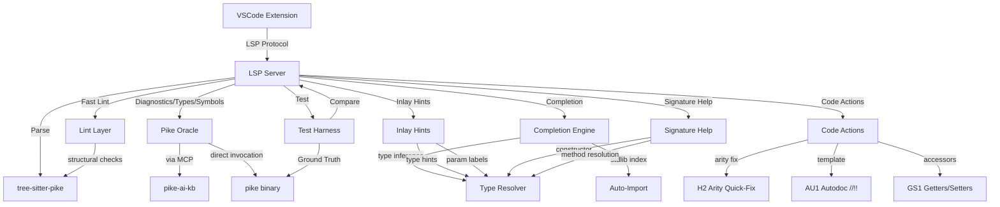

# Architecture

> This document describes the system design and component structure. Keep it updated as the project evolves.

## Overview

Pike Language Server is a tier-3 LSP implementation for the Pike programming language. It uses tree-sitter-pike as its syntactic parser and invokes the Pike compiler (`pike`) as an oracle for semantic information — diagnostics, types, and symbol resolution.

## System Diagram



## Project Structure

```
server/           # LSP server (TypeScript, vscode-languageserver-node)
client/          # VSCode extension that hosts the LSP server
harness/          # Test harness — invokes pike, captures ground truth, compares LSP output
corpus/           # Pike files covering language features the LSP must handle
  files/          # Actual Pike source files
  manifest.md     # Inventory of files and what features each exercises
docs/             # Investigation results, interface documentation
  decisions/      # Architecture Decision Records
decisions/        # Root-level decision documents (template convention)
```

## Core Components

### LSP Server (`server/`)

TypeScript application using `vscode-languageserver-node`. Handles LSP protocol, manages document state, coordinates between tree-sitter parsing and pike oracle queries.

### VSCode Extension (`client/`)

Hosts the LSP server as a subprocess. Registers Pike as a language for `.pike`, `.pmod`, `.mmod` files. Provides configuration UI.

### Test Harness (`harness/`)

Invokes `pike` on corpus files, captures output, produces structured ground-truth snapshots. Compares LSP output against ground truth. Includes canary tests for harness integrity.

### Corpus (`corpus/`)

Pike source files exercising the language features the LSP must handle: cross-module imports, inheritance, generic types, version compatibility, the full type system.

## Feature Modules

### Fast Lint Layer (`server/src/features/lintRules/`)

Tree-sitter-based lint rules running on every keystroke (<5ms). Detects structural issues: unused variables/parameters (P3001/P3002), unreachable code (P3003), missing return statements (P3004), unused imports (P3005). Lint diagnostics are suppressed on lines where the Pike compiler provides diagnostics — Pike is always authoritative.

### Completion Engine (`completion*.ts`, 9 modules)

Multi-stage completion: (1) keyword, (2) scoped local symbols from symbol table, (3) dot/arrow member access with type resolution, (4) chained call type inference via `resolveChainedType`/`decomposePostfixChain`, (5) auto-import suggestions from stdlib reverse index. Commit characters (`.` and `(`) for immediate acceptance.

- `completionTrigger.ts` — main trigger and dispatcher
- `completion.ts` — orchestrator and public API
- `completion-items.ts` — item construction and filtering
- `completion-stdlib.ts` — stdlib index loading and search
- `completion-chain.ts` — chained call resolution
- `completion-callArgs.ts` — argument-list completion
- `completion-scopeAccess.ts` — `::` scope access completion
- `completion-snippets.ts` — snippet generation helpers
- `completion-scope.ts` — scope symbol resolution

### Signature Help (`signatureHelp*.ts`)

Type-aware: resolves `Dog("Rex",` to constructor `create()` params, and `d->bark("hi",` to method signature via type -> class -> method lookup. Active parameter tracking highlights which parameter the cursor is on.

- `signatureHelp.ts` — main handler
- `signatureHelp-resolve.ts` — parameter resolution logic

### Inlay Hints (`inlayHints.ts`)

Two modes: (1) type hints for untyped variable declarations (G1), (2) parameter name labels at call sites with `comma_expr` unwrapping and method resolution (G2).

### Code Actions (`codeAction*.ts`, `autodocTemplate.ts`, `getterSetter.ts`)

- **Arity quick-fix** (H2): Adds/removes argument slots for "Wrong number of arguments" diagnostics.
- **Autodoc template** (AU1): `//!!` trigger above a declaration generates a `//!` skeleton with `@param` and `@returns` sections.
- **Getters/setters** (GS1): Generates `get_x()` / `set_x(value)` methods for class member variables.

### Type Resolver (`typeResolver.ts`)

Centralized type inference: resolves member access (`obj.field`), arrow access (`obj->method`), chained calls, and constructor types. Uses symbol table scope lookup with range-overlap for class scope discovery.

### PikeWorker (`pikeWorker*.ts`, 3 modules)

Manages the Pike compiler subprocess with priority queue, idle eviction, and SIGKILL escalation. Supports `warmUp()` for pre-warming during initialization. All responses validated at runtime via `jsonValidation.ts`.

- `pikeWorker.ts` — public API
- `pikeWorkerProcess.ts` — subprocess lifecycle and communication
- `pikeWorkerTypes.ts` — shared types

### Navigation (`navigation*.ts`, 7 modules)

Go-to-definition, references, implementation, document highlights, call hierarchy, folding ranges, selection ranges, and document symbols. Cross-file resolution via inherit/import chains.

- `navigationHandler.ts` — dispatcher
- `navigationGoTo.ts` — definition/implementation
- `navigationRefactoring.ts` — rename/prepare rename/workspace symbol
- `navigationCompletion.ts` — references/highlights
- `navigationDocumentFeatures.ts` — document symbol/folding/selection
- `navigationAdvanced.ts` — call hierarchy
- `navigationInclude.ts` — include/import navigation

### Symbol Table Pipeline

High-performance symbol table construction with O(1) position conversion and O(R log S) scope lookup.

- `symbolTable.ts` — symbol table builder: declarations, scopes, references
- `offsetMap.ts` — pre-computed byte-to-UTF-16 offset map per file (O(1) per lookup)
- `declarationCollector.ts` — tree-sitter node → declaration extraction
- `declarationBlockCollectors.ts` — block-scoped declaration collectors
- `referenceCollector.ts` — identifier reference collection
- `scope-helpers.ts` — scope construction helpers
- `cacheHash.ts` — DJB2 content hash utility (shared between index and cache)

### Workspace Indexing (`workspaceIndex.ts`, `backgroundIndex.ts`, `persistentCache.ts`)

Two-phase startup: cache restore (synchronous) → stale refresh (background) → full background index. Per-file cache entries with forward-dependency serialization enable pruned invalidation on restart.

- `workspaceIndex.ts` — central index: file entries, symbol tables, dependency graph
- `backgroundIndex.ts` — batch file discovery, parallel parse, sequential upsert
- `persistentCache.ts` — per-file JSON cache with atomic writes and format versioning
- `profiler.ts` — optional per-phase timing for build pipeline profiling

## Two-Speed Diagnostics

The LSP uses a two-speed diagnostic architecture:

| Speed | Source | Latency | Trigger | Scope |
|-------|--------|---------|---------|-------|
| Fast | tree-sitter lint | <5ms | Every keystroke | Structural issues |
| Slow | Pike compiler | ~500ms | Debounced | Semantic issues |

Lint diagnostics are suppressed on lines where Pike provides diagnostics, preventing duplicate/conflicting messages.

## External Integrations

| Dependency | Purpose | Version |
|------------|---------|---------|
| [tree-sitter-pike](https://github.com/TheSmuks/tree-sitter-pike) | Syntactic parser (WASM) | v1.2.2 |
| [pike-ai-kb](https://github.com/TheSmuks/pike-ai-kb) | Pike semantics oracle (MCP tools) | latest |
| `pike` binary | Ground truth for diagnostics, types, symbols | 8.0+ |
| `vscode-languageserver-node` | LSP protocol implementation | latest |
| `stdlib-autodoc.json` | Stdlib API index for auto-import/signature help | bundled |

## Development Environment

- Node.js 22+
- bun package manager
- Pike 8.0+ on PATH
- VS Code 1.85+ for extension development
