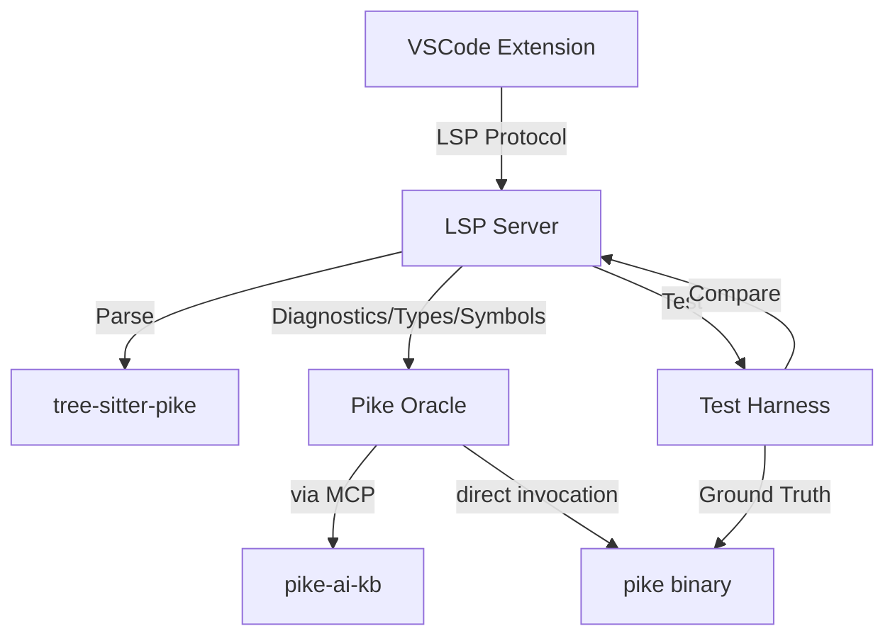

# Architecture

> This document describes the system design and component structure. Keep it updated as the project evolves.

## Overview

Pike Language Server is a tier-3 LSP implementation for the Pike programming language. It uses tree-sitter-pike as its syntactic parser and invokes the Pike compiler (`pike`) as an oracle for semantic information — diagnostics, types, and symbol resolution.

## System Diagram



## Project Structure

```
server/           # LSP server (TypeScript, vscode-languageserver-node)
extension/        # VSCode extension that hosts the LSP server
harness/          # Test harness — invokes pike, captures ground truth, compares LSP output
corpus/           # Pike files covering language features the LSP must handle
  files/          # Actual Pike source files
  manifest.md     # Inventory of files and what features each exercises
docs/             # Investigation results, interface documentation
  decisions/      # Architecture Decision Records
decisions/        # Root-level decision documents (template convention)
```

## Core Components

### LSP Server (`server/`)

TypeScript application using `vscode-languageserver-node`. Handles LSP protocol, manages document state, coordinates between tree-sitter parsing and pike oracle queries.

### VSCode Extension (`extension/`)

Hosts the LSP server as a subprocess. Registers Pike as a language for `.pike`, `.pmod`, `.mmod` files. Provides configuration UI.

### Test Harness (`harness/`)

Invokes `pike` on corpus files, captures output, produces structured ground-truth snapshots. Compares LSP output against ground truth. Includes canary tests for harness integrity.

### Corpus (`corpus/`)

Pike source files exercising the language features the LSP must handle: cross-module imports, inheritance, generic types, version compatibility, the full type system.

## External Integrations

| Dependency | Purpose | Version |
|------------|---------|---------|
| [tree-sitter-pike](https://github.com/TheSmuks/tree-sitter-pike) | Syntactic parser | v1.1 |
| [pike-ai-kb](https://github.com/TheSmuks/pike-ai-kb) | Pike semantics oracle (MCP tools) | latest |
| `pike` binary | Ground truth for diagnostics, types, symbols | 8.0+ |
| `vscode-languageserver-node` | LSP protocol implementation | latest |

## Development Environment

- Node.js 22+
- bun package manager
- Pike 8.0+ on PATH
- VS Code 1.85+ for extension development
